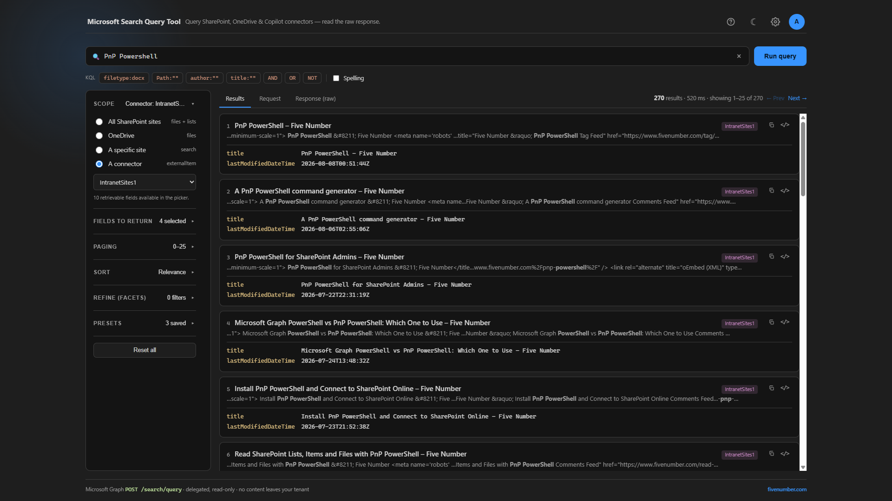
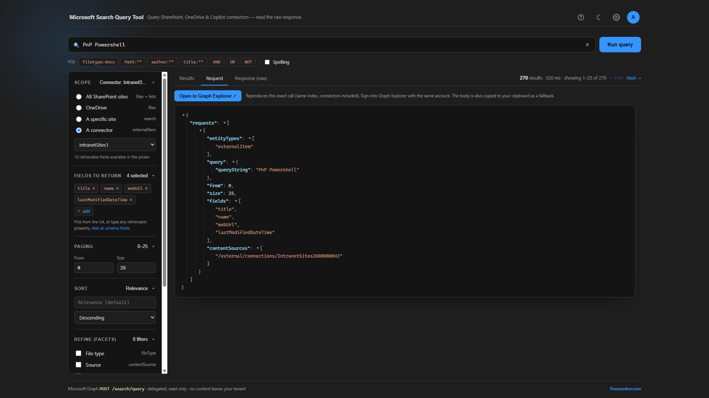

# Microsoft Search Query Tool

A small local tool to build and test **Microsoft Search** queries against the Microsoft Graph
`POST /search/query` API, and read the exact request and response. It is the cloud/Copilot-era
successor to the classic *SharePoint Search Query Tool*: it can query **SharePoint, OneDrive, and
Copilot connectors (external items)** from one place, which the old tool cannot.

It runs as a console app that hosts a local web UI in your browser. Nothing leaves your tenant.



A step-by-step walkthrough is on the blog:
[Microsoft Search Query Tool for SharePoint, OneDrive and Copilot connectors](https://www.fivenumber.com/microsoft-search-query-tool/).

## Features

- Query across entity types: `driveItem` (SharePoint/OneDrive), `listItem`, `site`, and
  `externalItem` (Copilot connectors).
- **Connection picker** — the tool lists your Copilot connectors, so you pick one instead of pasting
  an id. Results are badged with the actual connector name.
- **Fields** — request any retrievable property, or load them from a connection's schema.
- **Sort**, **paging** (Prev/Next), and **refiners** (facets with drill-down chips, like Microsoft
  Search).
- **KQL** — the query box accepts KQL (`filetype:docx`, `Path:"..."`, `author:"..."`, `title:...`,
  `AND/OR/NOT`, prefix wildcards). One-click example chips are provided.
- **Results**, **Request**, and **Response (raw)** tabs — the raw Graph request and response render
  as a collapsible, syntax-highlighted JSON tree.
- **Verify** tab — shows the KQL and builds links to reproduce the query in SharePoint enterprise
  search (results in a browser tab).
- Sign in / sign out / **sign in as different user**, light and dark themes.

## Prerequisites

- [.NET 8 SDK](https://dotnet.microsoft.com/download) (or newer).
- A Microsoft 365 work account that can read the content you want to query.

No app registration is required. The tool signs in using the well-known **Microsoft Graph Command
Line Tools** public client and asks you to consent to three read-only scopes:
`Sites.Read.All`, `ExternalItem.Read.All`, and `ExternalConnection.Read.All`.

## Run it

```
cd search-query-tool
dotnet run
```

The browser opens at `http://localhost:5089`. Click the **account circle** (top-right) to sign in
and consent, then run a query.

The **Request** tab shows the exact `POST /search/query` body being sent, and **Open in Graph
Explorer** reproduces the same call:



## Configuration

Override defaults in `appsettings.json`:

| Key | Default | Notes |
| --- | --- | --- |
| `ClientId` | Graph CLI public client | Set to your own app registration's client id for production. |
| `TenantId` | `organizations` | Set to a specific tenant id or domain to force that tenant. |
| `Url` | `http://localhost:5089` | Local listen address. |

To use your **own app registration**: register a public client, enable public client flows, add
delegated `Sites.Read.All`, `ExternalItem.Read.All`, `ExternalConnection.Read.All`, grant admin
consent, and put its client id in `appsettings.json`.

## Notes and limitations

- Cloud only (Graph). No on-premises SharePoint, no FQL, no query rules or result sources.
- `externalItem` queries require a connection; property restrictions like `Path:` and `filetype:`
  apply to SharePoint/OneDrive, not connector items (those use their own connector schema).
- It is a local, single-user tool: it binds to `localhost` only and uses your own delegated token.

## Roadmap

- A Copilot **Retrieval API** compare panel (what Copilot would ground on for the same query).
  Requires a Microsoft 365 Copilot license or Retrieval API pay-as-you-go, so it is deferred.

## License

MIT — see [LICENSE](LICENSE).
